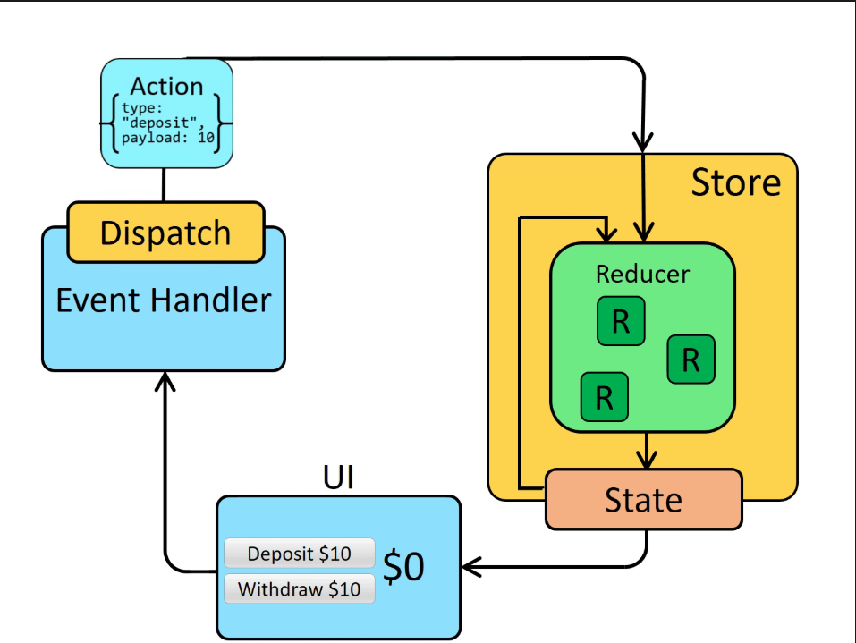

# Redux Installation and Setup Guide

## Redux Data Flow

Below is a visual representation of how Redux works:



The diagram shows the core concepts of Redux:

- **Action**: An object describing what happened (e.g., deposit action with payload)
- **Dispatch**: The process of sending actions to the store
- **Store**: Contains the application state and reducers
- **Reducer**: Pure functions that specify how state changes in response to actions
- **State**: The single source of truth for your application data
- **UI**: The view layer that reflects the current state and dispatches actions

## Installing Redux in a React Project

1. First, install the required packages:

```bash
npm install @reduxjs/toolkit react-redux
```

## Basic Setup Steps

1. **Create a Redux Store**
   - Create a file `src/redux/store.ts`
   - Configure your store with Redux Toolkit

```typescript
import { configureStore } from "@reduxjs/toolkit";

export const store = configureStore({
  reducer: {
    // Add your reducers here
  },
});

export type RootState = ReturnType<typeof store.getState>;
export type AppDispatch = typeof store.dispatch;
```

2. **Set up Redux Provider**
   - Wrap your app with Redux Provider in `src/main.tsx`:

```typescript
import { Provider } from "react-redux";
import { store } from "./redux/store";

ReactDOM.createRoot(document.getElementById("root")!).render(
  <React.StrictMode>
    <Provider store={store}>
      <App />
    </Provider>
  </React.StrictMode>
);
```

3. **Create TypeScript Hooks** (for TypeScript projects)
   - Create a file `src/redux/hooks.ts`:

```typescript
import { useDispatch, useSelector } from "react-redux";
import type { TypedUseSelectorHook } from "react-redux";
import type { RootState, AppDispatch } from "./store";

export const useAppDispatch: () => AppDispatch = useDispatch;
export const useAppSelector: TypedUseSelectorHook<RootState> = useSelector;
```

4. **Create a Slice**
   - Create a new file for your slice (e.g., `src/redux/features/counter/counterSlice.ts`)
   - Define your slice with initial state and reducers:

```typescript
import { createSlice } from "@reduxjs/toolkit";

const initialState = {
  value: 0,
};

export const counterSlice = createSlice({
  name: "counter",
  initialState,
  reducers: {
    increment: (state) => {
      state.value += 1;
    },
    decrement: (state) => {
      state.value -= 1;
    },
  },
});

export const { increment, decrement } = counterSlice.actions;
export default counterSlice.reducer;
```

5. **Add Slice to Store**
   - Import and add your slice reducer to the store:

```typescript
import counterReducer from "./features/counter/counterSlice";

export const store = configureStore({
  reducer: {
    counter: counterReducer,
  },
});
```

## Using Redux in Components

```typescript
import { useAppSelector, useAppDispatch } from "../redux/hooks";
import { increment, decrement } from "../redux/features/counter/counterSlice";

function Counter() {
  const count = useAppSelector((state) => state.counter.value);
  const dispatch = useAppDispatch();

  return (
    <div>
      <button onClick={() => dispatch(decrement())}>-</button>
      <span>{count}</span>
      <button onClick={() => dispatch(increment())}>+</button>
    </div>
  );
}
```

## Best Practices

1. Use Redux Toolkit's `createSlice` for creating reducers and actions
2. Implement TypeScript for better type safety
3. Keep related state together in slices
4. Use the Redux DevTools Extension for debugging
5. Follow the Redux style guide for consistent code organization
